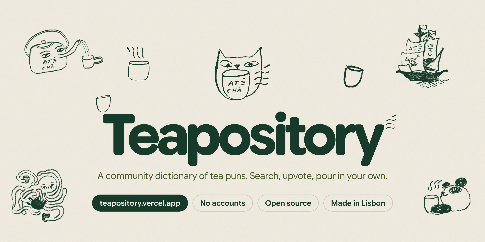
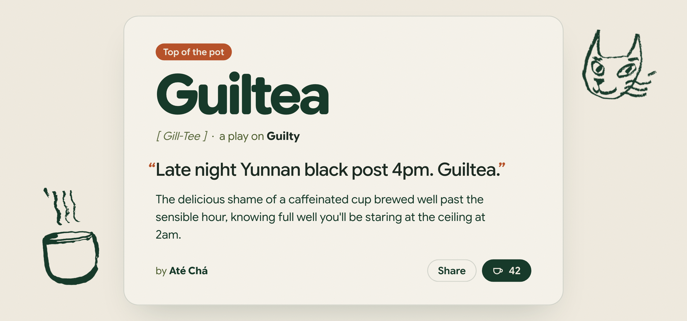
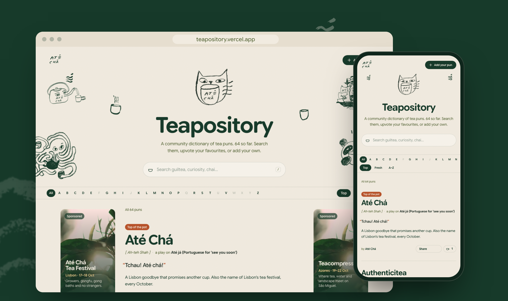
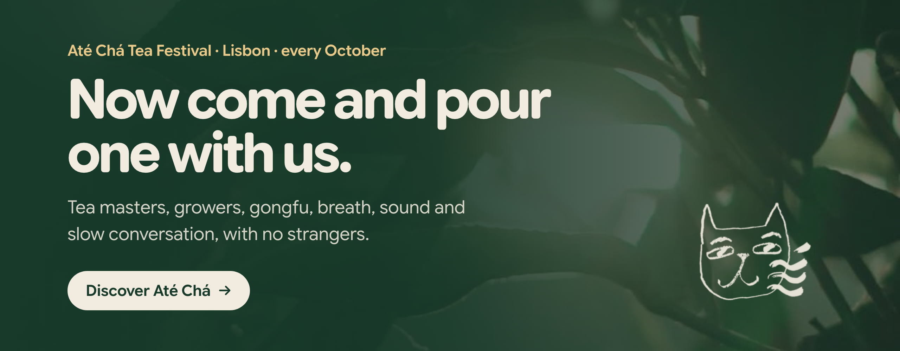

<p align="center">
  <a href="https://teapository.vercel.app"></a>
</p>

<p align="center">
  <b>A community dictionary of tea puns</b>, steeped in Lisbon by <a href="https://atecha.co">Até Chá</a>.<br>
  <a href="https://teapository.vercel.app"><b>teapository.vercel.app</b></a> &nbsp;·&nbsp; <a href="#add-a-pun">Pour in a pun</a> &nbsp;·&nbsp; <a href="#deploy-your-own">Run your own</a>
</p>

<br>

## Every pun gets its own dictionary page

<p align="center">
  
</p>

Each entry has a word, how to say it, the word it plays on, a sentence and a definition. Every pun also gets a clean link and a preview image made for sharing.

- 🫖 **No accounts, ever.** Anyone can add a pun or upvote one. An anonymous cookie stops the same browser voting twice.
- 🔎 **Search and browse.** Search as you type, jump by letter, and sort by Top, Fresh or A–Z.
- 🐙 **Open source.** Fork it, add puns, or run your own copy.

<p align="center">
  
</p>

## Add a pun

- **On the site:** press **Add your pun**. New puns steep for a moment while a moderator gives them a taste test, then they go live.
- **On GitHub:** add an entry to [`data/puns.ts`](data/puns.ts) and open a pull request. See [CONTRIBUTING.md](CONTRIBUTING.md).

## Run it locally

```bash
npm install
npm run dev
```

With no storage configured, the site runs read-only with the puns in `data/puns.ts`. Voting and submissions are switched off.

## Deploy your own

1. Import the repo into Vercel.
2. Add an **Upstash Redis** database from the Vercel Marketplace. It sets `KV_REST_API_URL` and `KV_REST_API_TOKEN`. `UPSTASH_REDIS_REST_URL` and `UPSTASH_REDIS_REST_TOKEN` also work.
3. Set these environment variables:

| Variable | Purpose |
| --- | --- |
| `ADMIN_TOKEN` | Password for `/admin` (the tasting table), where you approve or reject submissions. |
| `MODERATION` | Set to `off` to publish submissions immediately. On by default. |

Spam protection includes a honeypot field, a no-links rule, and per-IP rate limits. IPs are only stored as salted hashes, and they expire.

## Stack

Next.js (App Router), React, Tailwind CSS v4, Upstash Redis. The illustrations belong to Até Chá.

## Licence

Code is MIT. The Até Chá name, logo and illustrations are not covered by the MIT licence. Please swap them out if you run your own copy.

<br>

<p align="center">
  <a href="https://atecha.co"></a>
</p>
